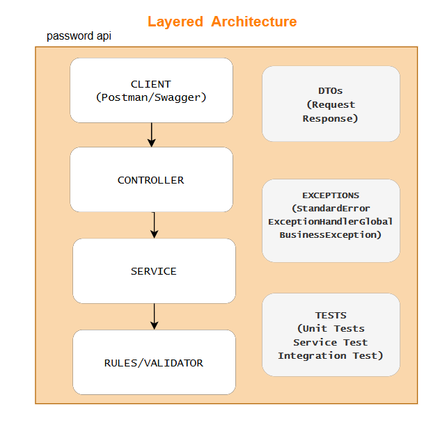

# 🔐 Password Validator API

API REST desenvolvida em **Java 17 + Spring Boot** para validar senhas conforme regras específicas.

O objetivo da aplicação é verificar se uma senha atende aos critérios de segurança e retornar um **boolean indicando se a senha é válida ou não**.

---

# 📌 Descrição do problema

Uma senha é considerada **válida** quando atende às seguintes regras:

- Possuir **9 ou mais caracteres**
- Possuir **ao menos 1 dígito**
- Possuir **ao menos 1 letra minúscula**
- Possuir **ao menos 1 letra maiúscula**
- Possuir **ao menos 1 caractere especial**

Caracteres especiais permitidos:
```
!@#$%^&*()-+
```

Além disso:

- **Não pode conter espaços**
- **Não pode possuir caracteres repetidos**

Exemplo:

```java
IsValid("") // false
IsValid("aa") // false
IsValid("ab") // false
IsValid("AAAbbbCc") // false
IsValid("AbTp9!foo") // false
IsValid("AbTp9!foA") // false
IsValid("AbTp9 fok") // false
IsValid("AbTp9!fok") // true

```
🏗 Arquitetura da solução

**Layered  Architecture**


(feito por Melissa Ferreira)

A aplicação foi estruturada seguindo boas práticas de engenharia de software, separando responsabilidades em camadas.

```
controller
dto
service
   └── validator
exception
test
```

### Camadas

**Controller**

Responsável por expor os endpoints da API e receber as requisições HTTP.
No código, escolhi fazer apenas um POST, pois, o foco da API é receber uma senha, verificar se está formatada conforme as regras de negócio, e devolver um boolean.
Segue exemplo:

```java
@RestController
@RequestMapping("/validacao")
public class SenhaController {

    @Autowired
    ValidadorSenhaService validadorSenhaService;

    @PostMapping
    public ResponseEntity<SenhaResponse> validarSenha(@RequestBody @Valid SenhaRequest senhaRequest)
    {
        boolean valido = validadorSenhaService.validador(senhaRequest.senha);

        SenhaResponse senhaResponse = new SenhaResponse();
        senhaResponse.senhaValidada = valido;

        return ResponseEntity.ok().body(senhaResponse);
    }
}
```

**Service**

Contém a regra de negócio da aplicação.
Nesse projeto, separei cada validação com a sua própria lógica em arquivos diferentes para poder executar testes de unidade com mais precisão.
Cada classe das validações implementam a Senha Validação (uma interface) são adicionadas a uma lista (do tipo SenhaValidação também) e
validadas dentro de uma estrutura de loop "for".

```java
@Service
public class ValidadorSenhaService {

    private final List<SenhaValidacao> validacoes;

    public ValidadorSenhaService() {

        this.validacoes = List.of(
      -- Classes de validação vão aqui --
        );
    }

    public boolean validador(String senha) {

        for (SenhaValidacao validacao : validacoes) {
            if (!validacao.validador(senha)) {
                return false;
            }
        }
        return true;
    }
}
```

**DTOs**

Manipulação da entrada e retorno de dados da API

- SenhaRequest (recebe um String)
- SenhaResponse (retorna um boolean)

**Validator**

Implementação das regras de validação da senha.
Exemplos:

- RegraTamanhoMinimo
- RegraDigito
- RegraLetraMaiuscula
- RegraLetraMinuscula
- RegraCaractereEspecial
- RegraCaracterUnico

**Exception**

Tratamento centralizado de erros da aplicação seguindo a estrutura:

- StandardError
- ExceptionHandlerGlobal
- BusinessException

**Estratégia de resposta da API**

Embora o desafio peça **apenas o retorno de um boolean** indicando se a senha é válida,
optei por tratar violações das regras de senha como erro de requisição (HTTP 400).

Essa decisão foi tomada porque a senha inválida representa uma falha na entrada enviada
pelo cliente da API, e não um resultado de processamento bem-sucedido (HTTP 200).

Dessa forma, quando uma regra de validação falha, a API retorna:

- boolean false (como solicitado no desafio)
- HTTP 400 (Bad Request)
- Uma mensagem explicando qual regra foi violada

Isso permite que o cliente entenda claramente o motivo da falha e corrija a senha informada, pois, somente com o boolean não é possível visualizar a regra de negócio que não foi seguida. E retornando um HTTP 200 para a requisição, mesmo a senha estando fora do formato definido, demonstra divergência na validação dos dados.

🎯 Padrões e boas práticas aplicadas

| Conceito          | Onde aparece                                               |
| ----------------- | ---------------------------------------------------------- |
| Abstração         | Interface `SenhaValidacao`                                 |
| Baixo acoplamento | Service depende da interface e não das regras concretas    |
| Extensibilidade   | Novas regras podem ser adicionadas sem modificar o serviço |
| Coesão            | Cada classe possui uma responsabilidade específica         |


**SOLID**

A solução aplica princípios do SOLID, principalmente o Single Responsibility Principle,
pois cada classe de validação possui apenas uma responsabilidade específica.

🔌 Design da API

Endpoint

```POST /validacao```

Request
```
{
  "senha": "AbTp9!fok"
}
```
Response
```
{
  "senhaValidada": true
}
```
ou
```
    "senhaValidada": false, --> boolean

   -- adicionais --
    "tempoErro": "", 
    "status": 400,
    "erro": "Regra de negócio",
    "mensagem": "",
    "caminhoUrl": "/validacao"
```
🧪 Testes

A aplicação possui testes para garantir o correto funcionamento das regras.

**Testes unitários**

Testam individualmente as regras de validação.

Exemplo:

- validação de tamanho mínimo
- validação de dígito
- validação de caracteres especiais

**Testes de service**

Testam a lógica completa de validação de senha utilizando Given/When/Then

**Testes de integração**

Testar o endpoint da API utilizando Spring Boot Test utilizando Given/When/Then e @DisplayName

📈 Adicionais:

- Validação de senha vazia
- Logs
- Teste de Service
- Estrutura de Exception: ExceptionHandlerGlobal
- Layered  Architecture

🧰 Tecnologias utilizadas

- Java 17
- Spring Boot
- Spring Web
- Spring Validation
- Lombok
- JUnit
- Mockito
- Spring Boot Test
- Swagger

📊 Observabilidade

Foram adicionados logs na aplicação para auxiliar na análise de comportamento e possíveis erros.

📚 Documentação da API

A documentação interativa da API está disponível via Swagger:

http://localhost:8080/swagger-ui/index.html

🗂 Organização do desenvolvimento

Para organização das tarefas foi utilizado um quadro Kanban no Trello.
https://trello.com/b/6yh2ds0m/password

🚀 Como executar o projeto

- Clone o repositório
```
git clone https://github.com/mel-ferreira/password.git
```
- Entre na pasta do projeto
```
cd password
```
- Execute a aplicação
```
./mvnw spring-boot:run
```
- A API estará disponível em:
```
http://localhost:8080
```
✨ Autora

Projeto desenvolvido por Melissa Ferreira como parte de um desafio técnico.